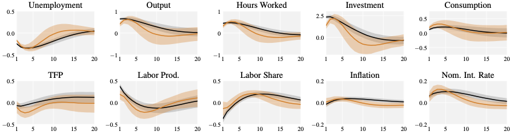
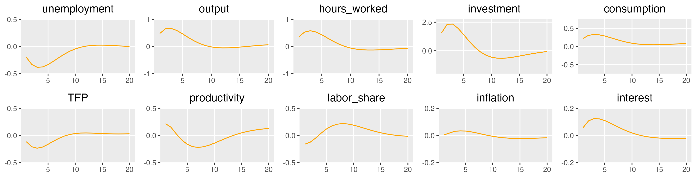

# What is being replicated
The goal is to replicate Figure 20 of the Online Appendix, copied below.

```{r fig20, echo = F, fig.cap="Figure 20: Impulse Response Functions to the MBC Shock: Bayesian vs Classical Inference", out.width = "100%"}

```

In particular, the Orange line in the figure above shows the Classical VAR, the black line shows the Bayesian VAR.
Both are targetting the business cycle frequency domain for unemployment.
The orange band shows the 68% bootstrapped confidence interval.
The orange line *actually* shows the median of the boostrapped VAR IRFs, but I have pulled the non-bootstrapped IRF for comparison below. 
The median is very close (see below).

Yet to be implemented: bootstrapping the replicated VAR.

# Replication

### Construct the replicated IRFs
Load in the packages.
```{r loadPackages, message = FALSE}
#devtools::install_github("VFCI/bcadata")
#devtools::install_github("VFCI/fevdid")

require(ggplot2)
require(data.table)
require(dplyr)
require(bcadata)
require(vars)
require(svars)
require(fevdid)
```

Pull the correct vintage of the BCA dataest.
This technically doesn't need an fred_api_key to run for the vintages, so just putting an "X" here.
The BCA code for the classical VAR drops 2017:Q2 - 2017:Q4.  
This seems unintentional, as these observations are not dropped for the Bayesian VARs.
```{r loadData}
bcadata <- pull_bcadata("X", replicate = TRUE) |>
    filter(date <= as.Date("2017-01-01"))
```

The target business cycle "frequencies" are between $\frac{2\pi}{32}$ and $\frac{2\pi}{6}$.
The target variable is unemployment.
```{r bc_freqs}
bc_freqs <- c(2 * pi / 32, 2 * pi / 6)
target_var <- "unemployment"
```

Construct the VAR, and identify the rotation that maxmizes the explained variance of unemployment in the target business cycle "frequency".
```{r fitVAR}
v <- VAR(bcadata[,-1], p = 2, type = "const")
mv <- id_fevdfd(v, target = target_var, freqs = bc_freqs)
```

Get the IRFs for this VAR.
```{r mIRF}
mv_irf <- irf(mv, impulse = "Main", n.ahead = 40)
```

### Read in the original IRFs
```{r loadOriginalIRFs, message = F}
bca_irf_df <- fread("../../../data/bca_original_var_results.csv")
```
Some data cleaning steps.
```{r cleanOriginalIRFs, class.source = "fold-hide"}
bca_irf_df <- bca_irf_df |>
    filter(model == "classical_fd") |>
    rename(h = "horizon") |>
    mutate(h = h - 1) |>
    rename(value = "varirf") |>
    mutate(value = value) |>
    mutate(shock = "Main")
```

# Comparing the two IRFs
Some more data cleaning and merging, then plotting.
```{r mergeData, class.source = "fold-hide"}
mv_irf_df <- mv_irf[[1]] |>
    as_tibble() |>
    rename(h = "V1") |>
    tidyr::pivot_longer(-h) |>
    mutate(variable = stringr::str_extract(name, "(?<=%->%).*$")) |>
    mutate(shock = stringr::str_extract(name, "(?<= ).*(?= )")) |>
    dplyr::select(!name) |>
    mutate(model = "Replication")

comb_df <- data.table::rbindlist(list(mv_irf_df, bca_irf_df), use.names = T, fill = T)
```

```{r figCompare, class.source = "fold-hide", fig.cap="Comparison of Replicated IRF to Original", out.width = "100%"}
comb_df |>
    ggplot(aes(
        x = h,
        y = value
    )) +
    geom_hline(yintercept = 0, color = "black") +
    geom_line(aes(color = model, linetype = model), linewidth = 1.25) +
    facet_wrap(vars(variable), scales = "free_y", nrow = 2) +
    scale_color_manual(values = c("firebrick", "steelblue")) +
    theme_bw() +
    labs(y = NULL, x = "Horizon") +
    theme(legend.position = "bottom")
```


# Recreating Figure 20 Exactly

```{r plotRepFig20, message = F, warning = F, class.source = "fold-hide"}
plot_variable <- function(plot_var, y_lims, y_breaks) {
    mv_irf_df |> 
    filter(variable == plot_var) |>
    ggplot(aes(x = h + 1, y = -1 * value)) +
    geom_line(color = "orange") +
    labs(x = NULL, y = NULL, title = plot_var) +
    theme_gray(base_size = 11) +
    theme(panel.grid.minor = element_blank(), plot.title = element_text(hjust = 0.5)) +
    scale_y_continuous(limits = y_lims, breaks = y_breaks, expand = c(0, 0)) +
    scale_x_continuous(limits = c(1, 20))
}

plot <-
    cowplot::plot_grid(
        plot_variable("unemployment", c(-0.5, 0.5), c(-0.5, 0, 0.5)),
        plot_variable("output", c(-1, 1), c(-1, 0, 1)),
        plot_variable("hours_worked", c(-1, 1), c(-1, 0, 1)),
        plot_variable("investment", c(-2, 2.75), c(0, 2.5)),
        plot_variable("consumption", c(-0.75, 0.75), c(-0.5, 0, 0.5)),
        plot_variable("TFP", c(-0.5, 0.5), c(-0.5, 0, 0.5)),
        plot_variable("productivity", c(-0.5, 0.5), c(-0.5, 0, 0.5)),
        plot_variable("labor_share", c(-0.5, 0.5), c(-0.5, 0, 0.5)),
        plot_variable("inflation", c(-0.2, 0.2), c(-0.2, 0, 0.2)),
        plot_variable("interest", c(-0.2, 0.2), c(-0.2, 0, 0.2)),
        nrow = 2
    )

ggsave("figs/replicated_figure20.png", height = 3, width = 11.7, units = "in")
```

```{r fig20Replication, echo = F, fig.cap="Replicated Figure 20", out.width = "100%"}

```

```{r fig20_2, echo = F, fig.cap="Figure 20: Impulse Response Functions to the MBC Shock: Bayesian vs Classical Inference", out.width = "100%"}

```

# Comparing the Median Bootstrap to the non-Boostrapped VAR IRF
As mentioned in the introduction, the original figure 20 shows the median of the boostrapped IRFs.
This is very close to the non-bootstrapped IRF which was shown in figure REF.
```{r compareBootstrappedIRF, class.source = "fold-hide", fig.cap="Comparison of Replicated IRF to Original", out.width = "100%"}
bca_irf_df |>
    ggplot(aes(
        x = h
    )) +
    geom_hline(yintercept = 0, color = "black") +
    geom_line(aes(y = value, color = "Non-boostrapped IRF")) +
    geom_line(aes(y = median, color = "Median Boostrapped IRF")) +
    facet_wrap(vars(variable), scales = "free_y", nrow = 2) +
    scale_color_manual(values = c("firebrick", "goldenrod3")) +
    theme_bw() +
    labs(y = NULL, x = "Horizon") +
    theme(legend.position = "bottom")
```