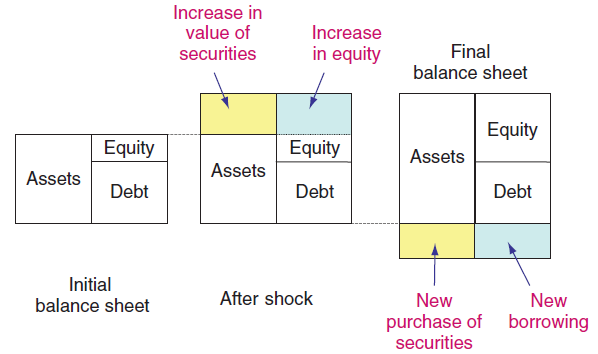

```{r}
#| include: false
library(data.table)
library(tidyfast)
library(vars)
library(fevdid)
library(vfciBCHelpers)
library(purrr)
library(ggplot2)
library(patchwork)
library(gt)
library(here)
library(dplyr)
```

```{r}
#| include: false

theme_pres <-
    theme_bw(base_size = 18) +
    theme(
        plot.title = element_text(hjust = 0.5),
        axis.text = element_text(size = 14, margin = margin(0, 0, 0, 0)),
        axis.title = element_text(size = 16),
        plot.caption = element_text(size = 13),
        panel.grid = element_blank(),
        plot.background = element_blank(),
        panel.background = element_blank(),
        strip.background = element_blank(),
        legend.key = element_blank(),
        legend.position = "top",
        legend.background = element_blank(),
        legend.title = element_text(size = 16),
        legend.margin = margin(0, 0, 0, 0),
        legend.text = element_text(size = 12),
        plot.margin = margin(10, 10, 0, 10, "pt")
        )

var_order <- c(
    VFCI = "vfci",
    Unemployment = "unemployment",
    Output = "output",
    `Fed Funds` = "interest",
    Inflation = "inflation",
    Investment = "investment",
    Consumption = "consumption",
    `Hours Worked` = "hours_worked",
    `Labor Share` = "labor_share",
    TFP = "TFP",
    `Labor Prod.` = "productivity"
)

crossplot_order <- c("Output", "Investment", "Consumption", "Hours Worked", "Fed Funds", "Labor Prod.", "Inflation", "TFP", "VFCI")

irf_horizon <- 32

## Colors
bg_line_color <- "gray50"
recession_color <- "gray80"

hv_macro_color <- "steelblue"
hv_fin_color <- "darkorange"
max_share_color <- "firebrick"
```

```{r var_setup}
lags <- 2
bc_freqs <- c( 2 * pi / 32, 2 * pi / 6)

```

```{r load_recession_dates}
rec_dates <- get_recession_dt()
```

```{r}
vfci_dt <- est_vfci(
  y = "output",
  x = c("pc1", "pc2", "pc3", "pc4"),
  forward = 1
)
```


```{r}
#| include: false
fin_cols <- c("pc1", "pc2", "pc3", "pc4")

data <- get_var_data(
  vfci = NULL,
  end_date = "2022-07-01",
  make_stationary = TRUE
)

hv_macro <-
  data |>
  fit_var(lags = 2) |>
  id_linear_het_reg(
    target = "output",
    hetreg_horizon = 12,
    sign = "neg"
  )
```


```{r}
#| include: false
fin_cols <- c("pc1", "pc2", "pc3", "pc4")

data <- get_var_data(
  vfci = NULL,
  end_date = "2022-07-01",
  add_cols = fin_cols,
  make_stationary = TRUE
)

hv_fin <-
  data[, -c(fin_cols), with = FALSE] |>
  fit_var(lags = 2) |>
  id_linear_het_reg(
    target = "output",
    hetreg_horizon = 12,
    x2 = fin_cols,
    extra_data = data[, fin_cols, with = FALSE],
    method = "mriv",
    sign = "neg"
  )
```

```{r}
#| include: false
#| 
data <- get_var_data(
  vfci = NULL,
  end_date = "2022-07-01",
  make_stationary = TRUE
)

mv <- data |>
  fit_var(lags = 2) |>
  id_fevdfd("unemployment", 2 * pi / c(32, 6), sign = "pos")
```


```{r}
#| include: false

var_names <- 
  c(
    var_1 = "MBC",
    var_2 = "Fin",
    var_3 = "Macro"
  )

corr_dt <-
  list(
    mv,
    hv_fin,
    hv_macro
  ) |>
  hs_corr() |>
  _[impulse_x %in% c("Chol_1", "Main") & impulse_y %in% c("Chol_1", "Main")] |>
  _[, .(var_x, var_y, corr)] |>
  _[, var_x := factor(var_x, levels = names(var_names), labels = var_names, ordered = TRUE)] |>
  _[, var_y := factor(var_y, levels = names(var_names), labels = var_names, ordered = TRUE)] |>
  tidyfast::dt_pivot_wider(names_from = var_y, values_from = corr) 
```

```{r}
#| include: false

hv_macro_irf <-
  hv_macro |>
  irf(n.ahead = irf_horizon + 1) |>
  _$irf |>
  as.data.table() |>
  _[impulse == "Chol_1"] |>
  _[, model := "hv_macro"] |>
  _[, response := factor(response, levels = var_order, labels = names(var_order))]

hv_macro_hd <-
  hv_macro |>
  fevdid::hd() |>
  _$hd |>
  as.data.table() |>
  _[impulse == "Chol_1"] |>
  _[response %in% c("unemployment", "output")] |>
  merge(copy(data)[, t := .I - 2][,. (t, date)], by = "t") |>
  _[, model := "hv_macro"] |>
  _[, response := factor(response, levels = var_order, labels = names(var_order))]
```


```{r}
hv_fin_irf <-
  hv_fin |>
  irf(n.ahead = irf_horizon + 1) |>
  _$irf |>
  as.data.table() |>
  _[impulse == "Chol_1"] |>
  _[, model := "hv_fin"] |>
  _[, response := factor(response, levels = var_order, labels = names(var_order))]

hv_fin_hd <-
  hv_fin |>
  fevdid::hd() |>
  _$hd |>
  as.data.table() |>
  _[impulse == "Chol_1"] |>
  _[response %in% c("output", "unemployment") ] |>
  merge(copy(data)[, t := .I - 2][,. (t, date)], by = "t") |>
  _[, model := "hv_fin"] |>
  _[, response := factor(response, levels = var_order, labels = names(var_order))]
```

```{r}
mv_irf <-
  mv |>
  irf(n.ahead = irf_horizon + 1) |>
  _$irf |>
  as.data.table() |>
  _[impulse == "Main"] |>
  _[, model := "mbc"] |>
  _[, response := factor(response, levels = var_order, labels = names(var_order))]

mv_hd <-
  mv |>
  fevdid::hd() |>
  _$hd |>
  as.data.table() |>
  _[impulse == "Main"] |>
  _[response %in% c("output", "unemployment")] |>
  merge(copy(data)[, t := .I - 2][,. (t, date)], by = "t") |>
  _[, model := "mbc"] |>
  _[, response := factor(response, levels = var_order, labels = names(var_order))]
```

## The Business Cycle is the Short-Run Comovement of Macro Variables

-   The *business cycle* is the comovement among macroeconomic 
variables over the 1 to 10 year "short run"
-   Patterns of comovement are qualitatively the same 
across different cycles
-   Empirically, a single shock captures majority of variation in
macro variables at business cycle frequencies
-   In models, usually one big shock:
    -   TFP, demand, beliefs, confidence, etc.
-   Common propagation mechanism can look like a single shock

. . .

## Source of Business Cycle Crucial for Welfare and Policy
-   Type of shock and propagation determine whether fluctuations are inefficient
-   Crucial for welfare and policy
-   Understanding sources of fluctuations also helps select models that are
consistent with data
-   One of the main goals of macro is to understand business cycles

## We Construct Three Shocks that Generate the Business Cycle {#what-do-we-do}

1. Business cycle shock
    - Statistically constructed to explain as much business cycle variation 
    as possible
2. Macroeconomic uncertainty shock
    - Uncertainty: second moment of output growth
    - Shock: third-moment effect --- innovation to the second moment
3. Price of risk shock
    - Price of risk: equilibrium compensation to hold aggregate risk

<!-- :::{.aside} -->
<!-- [[Related Literature]{.button}](#literature-review) -->
<!-- ::: -->

## Three Shocks are Essentially the Same

```{r}
#| echo: false
#| fig-width: 12
#| fig-height: 6.5
#| fig-align: 'center'
#| out-width: "95%"
#| out-height: "85%"

df <- bind_rows(mv_irf, hv_fin_irf, hv_macro_irf)

# check your available responses
# unique(df$response)   # uncomment this line to diagnose

wanted <- c("Unemployment", "Output", "Investment", "Consumption")

df2 <- df %>%
  filter(response %in% wanted) %>%
  mutate(
    response = factor(response, levels = wanted),
    h = h - 1  # Shift to start at 0 (contemporaneous impact)
  )

ggplot(df2, aes(x = h, y = irf, color = model)) +
  geom_hline(yintercept = 0, color = bg_line_color) +
  geom_line() +
  facet_wrap(vars(response), ncol = 2, scales = "free_y") +
  scale_color_manual(
    name   = "Shock",
    values = c(
      mbc      = max_share_color,
      hv_macro = hv_macro_color,
      hv_fin   = hv_fin_color
    ),
    labels = c(
      mbc      = "Business Cycle Shock",
      hv_macro = "Macroeconomic Uncertainty",
      hv_fin   = "Price of Risk"
    ),
    breaks = c("mbc", "hv_macro", "hv_fin")
  ) +
  scale_x_continuous(
    breaks = seq(0, 32, 8),
    limits = c(0, 32)
  ) +
  labs(x = "Horizon (quarters)", y = "Impulse Response") +
  theme_pres +
  theme(
    legend.position  = "right",
    legend.direction = "vertical",
    plot.margin = margin(5, 5, 5, 5, "pt"),
    legend.title = element_text(size = 20),
    legend.text = element_text(size = 16)
  )

```

---

## The Three Shocks are Constructed Differently

-   Business cycle shock
    -   From macro data only
    -   Uses first and second moments
-   Uncertainty shocks
    -   From macro data only (same as business cycle shock)
    -   By construction, a *third* moment
-  Price of risk shock  
    -   From consumption (only macro variable) and financial data
    -   Also works using GDP

<!-- ## Equilibrium Implies a Stochastic Discount Factor -->

<!-- -   Financial assets are contracts defined by their payoffs -->
<!--     -   Asset $i$ has price $P_{it}$ and payoff $D_{it}$ -->

<!-- **Fundamental Theorem of Asset Pricing (FTAP)** -->

<!-- Absence of arbitrage $\implies$ Existence of a stochastic discount factor (SDF): -->

<!-- :::{#eq:euler} -->
<!-- $$ -->
<!-- P_{it} = \mathbb{E}_t[\mathrm{SDF}_{t+1} (P_{i,t+1}+D_{i,t+1})]\quad \text{for all $i$ and $t$}\\ -->
<!-- $$ -->
<!-- ::: -->
<!-- with $SDF_{t+1} > 0$ -->

<!-- -   Equilibrium $\implies$ no-arbitrage $\implies$ SDF -->

<!-- ## The Market Price of Risk is the Volatility of the SDF -->

<!-- -   Market price of risk $\eta_t$ defined by: -->
<!-- $$ -->
<!--   \eta_t := \sqrt{\text{Var}_t(\mathrm{SDF}_{t+1})} -->
<!-- $$ -->
<!-- - The pricing equation can be re-written as: -->
<!-- $$ -->
<!-- \begin{align} -->
<!-- \mathbb{E}_tr_{i,t+1} -->
<!-- &\;=\; -->
<!-- -\,\mathrm{Cov}_t\bigl(\mathrm{SDF}_{t+1},\,r_{i,t+1}\bigr) -->
<!-- \;\propto\;\eta_t -->
<!-- \end{align} -->
<!-- $$ -->
<!-- where $r_{i,t+1} = R_{i,t+1} - R_{f,t}$ is the excess return of $i$ -->
<!-- For the the wealth portfolio ($i = w$) -->
<!-- $$ -->
<!-- \begin{align} -->
<!-- \eta_t -->
<!-- &\;=\; -->
<!-- \frac{\mathbb{E}_t\bigl[r_{w,t+1}\bigr]} -->
<!--      {\mathrm{Var}_t\bigl(r_{w,t+1}\bigr)} -->
<!-- \end{align} -->
<!-- $$ -->
<!-- -   For all $i$, the risk premium is proportional to the market price of risk -->
<!-- -   For the wealth portfolio the market price of risk is risk premium per unit of risk -->

<!-- ## First-Order Conditions Link Macro and Finance: CRRA -->

<!-- -   Representative agent with CRRA utility: -->
<!-- $$ -->
<!-- U(C) = \mathbb{E}_0 \sum_{t=0}^{\infty} \beta^t \frac{C_t^{1-\gamma}}{1-\gamma} -->
<!-- $$ -->
<!-- -   The FOC is: -->
<!-- $$ -->
<!-- \beta \left(\frac{C_{t+1}}{C_t}\right)^{-\gamma} = \mathrm{SDF}_{t+1} -->
<!-- $$ -->
<!-- -   Decompose $SDF_{t+1}$ into its expected and unexpected components  -->
<!-- $$ -->
<!-- \beta \left(\frac{C_{t+1}}{C_t}\right)^{-\gamma} = \mathbb{E}_t \mathrm{SDF}_{t+1} + (\mathrm{SDF}_{t+1} - \mathbb{E}_t\mathrm{SDF}_{t+1}) -->
<!-- $$ -->
<!-- -   Take logs and rearrange: -->
<!-- $$ -->
<!-- \Delta c_{t+1}=\frac{1}{\gamma}-\frac{1}{\gamma\beta}\mathbb{E}_{t}SDF_{t+1}+\varepsilon_{t+1} -->
<!-- $$ -->
<!-- where $\varepsilon_{t+1} = -\frac{1}{\gamma\beta}(\mathrm{SDF}_{t+1} - \mathbb{E}_t\mathrm{SDF}_{t+1})$ -->

<!-- --- -->

<!-- ## Projecting the SDF onto Financial Returns -->

<!-- -   Project $\mathrm{SDF}_{t+1}$ and $\lambda_t$ onto financial returns $R_t$ -->
<!-- $$ -->
<!-- \Delta c_{t+1} = \beta_0 + \sum_i \beta_i R_{i,t} + \varepsilon_{t+1} -->
<!-- $$ -->
<!-- for some constants $\beta_0$ and $\beta_i$ -->
<!-- -   Also project the variance onto financial returns $R_t$ -->
<!-- $$ -->
<!-- \log Var_{t}(\varepsilon_{t+1})=\delta_{0}+\sum_{i}\delta_{i}R_{i,t} -->
<!-- $$ -->

<!-- --- -->

## VAR Setup

-   Structural VAR($p$) with $k$ variables in vector $y_t$
$$
B_0 y_t = B_1 y_{t-1} + . . . + B_p y_{t-p} + w_t
$$
where structural shocks $w_t$ are white noise

. . .

-   Estimate reduced-form coefficients $A_i$ and residuals $u_t$
$$
 y_t = \underbrace{B_0^{-1}B_1}_{A_1} y_{t-1} + \dots + \underbrace{B_0^{-1}B_p}_{A_p} y_{t-p} + \underbrace{B_0^{-1}w_t}_{u_t}
$$

-   The shock identification problem: $u_t = B_0^{-1} w_t$

## Business Cycle Shock

Identify the business-cycle shock $w_t^{(\text{MBC})}$ as in @mbc2020.

1.    Pick a target variable (e.g. unemployment),
2.    Find linear combination of residuals $w_t^{(\text{MBC})} = b^\prime u_t$ that maximizes its contribution to the variance of target variable over business-cycle frequencies.

Using unemployment, output, consumption, investment, or hours worked, produces the same shock


## Construct a Macroeconomic Uncertainty Shock

-   Estimate VAR
-   Let $\sigma_{t+12}$ be the twelve-quarter-ahead forecast error for output growth
-   Measure macroeconomic uncertainty by $\mathbb{E}_t\sigma_{t+12}^2$
-   Run OLS regression

$$
\log \sigma_{t+12}^2 = \alpha y_{t} + \upsilon_t
$$

-   Fitted value $\widehat{\alpha} y_t$ is a valid instrument for a shock to uncertainty

## The Price of Risk

Absence of arbitrage implies the existence of an SDF (stochastic discount factor)

::: {.notes}
Absence of arbitrage is a necessary condition for equilibrium
:::

The SDF can be decomposed as

$$
\begin{align}
\text{SDF}_{t+1} = \mathbb{E}_t[\text{SDF}_{t+1}] + \underbrace{\text{Vol}_t[{\text{SDF}_{t+1}}]}_{\lambda_{t}} \epsilon_{t+1}
\end{align}
$$ {#eq-volatility-sdf}

where

- $\lambda_{t}$ is the price of risk
- $\epsilon_{t+1}$ is an innovation


## Optimality Conditions Link Macro and Finance

-   Assume a representative agent with CRRA utility for simplicity

-   The FOC of the representative agent is
$$
\mathrm{SDF}_{t+1} = \beta \left(\frac{C_{t+1}}{C_t}\right)^{-\gamma}
$$
-   Taking logs and combining with @eq-volatility-sdf, we get

$$
\Delta c_{t+1}=\frac{1}{\gamma}-\frac{1}{\gamma\beta}\mathbb{E}_{t}SDF_{t+1}+\varepsilon_{t+1}
$$
where $\varepsilon_{t+1} = -\frac{1}{\gamma\beta}(\mathrm{SDF}_{t+1} - \mathbb{E}_t\mathrm{SDF}_{t+1})$

## Estimating the Market Price of Risk

Projecting the $-\frac{1}{\gamma\beta}\mathbb{E}_{t}SDF_{t+1}$ and $\log Var_{t}(\varepsilon_{t+1})$ onto financial returns $R_t$, we can estimate $\lambda_{t}$ through a heteroskedastic regression

$$
\begin{align*}
\Delta c_{t+1} & =\beta_{0}+\sum_{i}\beta_{i}R_{i,t}+\varepsilon_{t+1}\\
\log Var_{t}(\varepsilon_{t+1}) & =\delta_{0}+\sum_{i}\delta_{i}R_{i,t}
\end{align*}
$$

Estimate by OLS with heteroskedasticity parametrized by a log-linear function (`hetregress` in Stata)


---

## Volatility Financial Conditions Index (VFCI)

-   Use $\hat{\delta}_{i}$ to estimate the market price of risk up to a
proportionality constant: 
$$
    \hat{\eta}_{t} \propto \exp\left(\frac{1}{2}\sum_{i}\hat{\delta}_{i}R_{i,t}\right)
$$
-   The "Volatility Financial Conditions Index" or VFCI is $\hat{\eta}_{t}$ normalized to mean zero
and standard deviation one
-   It is the volatility of consumption spanned by financial assets ---
    a linear combination of returns on financial assets (Stocks, Treasuries, Corporate bonds)
-   Measures price of risk in large class of representative agent models

---

```{r}
#| echo: false
#| fig-width: 11
#| fig-height: 5
#| fig-align: 'center'

library(plotly)

# Remove any NA values from vfci_dt
vfci_dt_clean <- vfci_dt[!is.na(date) & !is.na(vfci)]

# Define event dates and labels based on the provided table
events_dt <- data.table(
  event = c(
    "1962 Kennedy Slide",
    "1966 Credit Crunch", 
    "1967 Sterling Shock",
    "1968 Gold Crisis",
    "1969-70 Credit Crunch",
    "1973-74 Oil Embargo",
    "Franklin Natl Fail",
    "NYC Fiscal Crisis",
    "Volcker Shock",
    "1980 Credit Controls",
    "1981 Rate Peak",
    "1982 Latin American debt crisis",
    "Continental IL",
    "Black Monday",
    "1990-91 S&L",
    "1994 Bond Crash",
    "1997 Asian Crisis",
    "1998 LTCM / Russia Default",
    "2000-01 Dotcom",
    "Iraq war & ENRON",
    "2007 Subprime",
    "2008 Global Financial Crisis",
    "2011 Debt‑Ceiling & Euro Crisis",
    "2013 Taper Tantrum",
    "2015-16 China Devaluation & Oil price crash",
    "2018 Fed Selloff",
    "2020 COVID",
    "2022 Hikes",
    "2023 SVB"
  ),
  period_start = as.Date(c(
    "1962-04-01", "1966-04-01", "1967-10-01", "1968-01-01", "1969-04-01",
    "1973-10-01", "1974-10-01", "1975-10-01", "1979-10-01", "1980-01-01",
    "1981-07-01", "1982-07-01", "1984-07-01", "1987-10-01", "1990-01-01",
    "1994-04-01", "1997-07-01", "1998-07-01", "2000-04-01", "2002-01-01",
    "2007-07-01", "2008-07-01", "2011-07-01", "2013-04-01", "2015-07-01",
    "2018-10-01", "2020-01-01", "2022-04-01", "2023-01-01"
  )),
  period_end = as.Date(c(
    "1962-07-31", "1966-10-31", "1967-10-31", "1968-04-30", "1970-04-30",
    "1974-10-31", "1974-10-31", "1975-10-31", "1979-10-31", "1980-04-30",
    "1981-07-31", "1982-10-31", "1984-07-31", "1987-10-31", "1991-01-31",
    "1994-10-31", "1997-10-31", "1998-10-31", "2001-01-31", "2002-10-31",
    "2007-10-31", "2009-01-31", "2011-10-31", "2013-10-31", "2016-01-31",
    "2018-10-31", "2020-04-30", "2022-10-31", "2023-04-30"
  ))
)

# Create a mapping of all dates to events
# For each VFCI date, check if it falls within any event period
vfci_dt_clean[, event := as.character(NA)]

for (i in 1:nrow(events_dt)) {
  # Find all VFCI dates that fall within this event period
  matching_dates <- vfci_dt_clean[
    date %between% c(events_dt[i, period_start], events_dt[i, period_end]),
    which = TRUE
  ]
  
  if (length(matching_dates) > 0) {
    vfci_dt_clean[matching_dates, event := events_dt[i, event]]
  }
}

# Get y-axis range to match the original plot
y_min <- min(vfci_dt_clean$vfci)
y_max <- max(vfci_dt_clean$vfci)
y_range <- c(y_min - 0.1 * abs(y_min), y_max + 0.1 * abs(y_max))

# Get x-axis range with padding
x_min <- as.Date("1959-01-01")  # Start before 1960 to avoid tick alignment
x_max <- as.Date("2025-12-31")  # Extend 2 years beyond data end

# Define axis color to match ggplot2 theme_bw
axis_color <- "#4D4D4D"  # gray30 - typical for theme_bw axes

# Create hover text for all data points
vfci_dt_clean[, hover_text := ifelse(
  is.na(event),
  format(date, "%B %Y"),
  paste0("<b>", event, "</b><br>", format(date, "%B %Y"))
)]

# Create the interactive plot
p <- plot_ly()

# Add recession bars with adjusted opacity
recession_data <- rec_dates[start %between% as.Date(c("1962-01-01", "2022-01-01"))]
for(i in 1:nrow(recession_data)) {
  rec <- recession_data[i]
  p <- p %>% add_polygons(
    x = c(rec$start, rec$end, rec$end, rec$start, rec$start),
    y = c(y_range[1], y_range[1], y_range[2], y_range[2], y_range[1]),
    fillcolor = recession_color,
    opacity = 0.6,  # Reduce opacity to match ggplot appearance
    line = list(width = 0, color = "transparent"),
    showlegend = FALSE,
    hoverinfo = "skip",
    inherit = FALSE
  )
}

# Add horizontal line at 0 extending full x range
p <- p %>% add_lines(
  x = c(x_min, x_max),
  y = c(0, 0),
  line = list(color = "#7F7F7F", width = 1),  # gray50 hex equivalent
  showlegend = FALSE,
  hoverinfo = "skip"
)

# Add VFCI line with custom hover template
p <- p %>% add_lines(
  data = vfci_dt_clean,
  x = ~date,
  y = ~vfci,
  line = list(color = hv_fin_color, width = 2.4),
  name = "",
  hovertemplate = ~paste0(hover_text, "<extra></extra>"),
  showlegend = FALSE
)

# Layout to match original plot with axis lines and ticks
p <- p %>% layout(
  title = list(
    text = "Volatility Financial Conditions Index (VFCI)",
    font = list(size = 26, family = "Arial, sans-serif", color = "black"),
    x = 0.5,
    xanchor = "center",
    y = 0.98,
    yanchor = "top"
  ),
  xaxis = list(
    title = "",
    range = c(x_min, x_max),
    tickmode = "array",
    tickvals = as.Date(paste0(seq(1960, 2025, 5), "-01-01")),
    ticktext = seq(1960, 2025, 5),
    tickfont = list(size = 18, family = "Arial, sans-serif", color = axis_color),
    showgrid = FALSE,
    zeroline = FALSE,
    showline = TRUE,
    linecolor = axis_color,
    linewidth = 1,
    mirror = TRUE,
    ticks = "outside",
    ticklen = 6,
    tickwidth = 1.5,
    tickcolor = axis_color,
    showspikes = FALSE
  ),
  yaxis = list(
    title = "Index (mean = 0, std = 1)",
    titlefont = list(size = 20, family = "Arial, sans-serif", color = axis_color),
    tickfont = list(size = 18, family = "Arial, sans-serif", color = axis_color),
    showgrid = FALSE,
    zeroline = FALSE,
    range = y_range,
    showline = TRUE,
    linecolor = axis_color,
    linewidth = 1,
    mirror = TRUE,
    ticks = "outside",
    ticklen = 6,
    tickwidth = 1.5,
    tickcolor = axis_color,
    showspikes = FALSE
  ),
  plot_bgcolor = "white",
  paper_bgcolor = "white",
  hovermode = "closest",
  hoverlabel = list(
    bgcolor = "white", 
    font = list(size = 18, family = "Arial, sans-serif", color = axis_color),
    bordercolor = axis_color,
    borderwidth = 1,
    align = "left"
  ),
  showlegend = FALSE,
  margin = list(t = 40, b = 35, l = 50, r = 40),
  font = list(family = "Arial, sans-serif"),
  width = 1000,
  height = 450
)

# Configure plot for better display in presentations
p <- p %>% 
  config(
    displayModeBar = FALSE,  # Hide the toolbar
    responsive = TRUE        # Make it responsive to container
  )

p
```

---

## Same Strategy Works for General Preferences and Incomplete Markets

-   Encompasses habit formation, long-run risk, disaster risk, ambiguity aversion
-   Works with incomplete markets, frictions, pric stickiness, etc.
-   Key insight: very general preferences lead to *almost* the same empirical specification
    -   Have to add bond yields to the mean equation
    -   Bond yields are endogenous regressors, use heteroskedasticity as in Lewbel (2012)
    but turns out not to matter much empirically
    
---

## Mean-Vol Realationship for Consumption

```{r}
#| echo: false
#| fig-width: 8
#| fig-height: 6
#| fig-align: 'center'

# Estimate VFCI for consumption
consumption_vfci <- est_vfci(
  y = "consumption",
  x = c("pc1", "pc2", "pc3", "pc4"),
  forward = 1
)

# Create mean-vol scatter plot with fitted line
consumption_vfci |>
  _[!is.na(vfci) & !is.na(mu)] |>  # Remove missing values
  ggplot(aes(
    x = vfci,
    y = mu
  )) +
  geom_point(
    alpha = 0.7,
    size = 2,
    color = hv_fin_color
  ) +
  geom_smooth(
    method = "lm",
    se = FALSE,
    color = max_share_color,
    linewidth = 1,
    formula = y ~ x  # Explicitly specify formula to avoid the info message
  ) +
  labs(
    title = "Mean-Volatility Relationship for Consumption",
    x = "Volatility (VFCI)",
    y = "Conditional Mean"
  ) +
  theme_pres
```

## Mean-Vol Realationship for Consumption

```{r}
#| echo: false
#| fig-width: 8
#| fig-height: 6
#| fig-align: 'center'

# Estimate VFCI for consumption
consumption_vfci <- est_vfci(
  y = "output",
  x = c("pc1", "pc2", "pc3", "pc4"),
  forward = 1
)

# Remove missing values and fit regression
consumption_clean <- consumption_vfci[!is.na(vfci) & !is.na(mu)]
lm_fit <- lm(mu ~ vfci, data = consumption_clean)
r_squared <- summary(lm_fit)$r.squared

# Create mean-vol scatter plot with fitted line
consumption_clean |>
  ggplot(aes(
    x = vfci,
    y = mu
  )) +
  geom_point(
    alpha = 0.7,
    size = 2,
    color = hv_fin_color
  ) +
  geom_smooth(
    method = "lm",
    se = FALSE,
    color = max_share_color,
    linewidth = 1,
    formula = y ~ x
  ) +
  labs(
    title = "Mean-Volatility Relationship for Output",
    subtitle = paste0("R² = ", round(r_squared, 3)),
    x = "Volatility (VFCI)",
    y = "Conditional Mean"
  ) +
  theme_pres
```

---

## Evidence Points to Financial Shocks or Propagation

-   Business cycles tightly linked to financial conditions and macro uncertainty
-   Shocks move first and second moments of macro variables at the same time
-   Either one big financial shock or common propagation of other shocks through financial system

### Takeaway
-   Difficult to reconcile with standard models and shocks
-   Suggests models with financial frictions

::: {.notes}
1)    no standard model has a financial shock as the big shock. Models
without financial shocks rarely have strong financial propagation.
2)    time-varying second moments indicate first and second order approximations
are not sufficient (second order approx gives constant price of risk); any
model that is linear(ized) or approx to second order will not work
3)    preference/belief shocks must hit second moment of consumption (or 
whatever variable determines marginal utility)
:::

---

## Overview of Microfounded Non-Linear Model

- Firm optimization gives standard New Keynesian Phillips Curve

- Households as in New Keynesian model but
  - Cannot finance firms directly
  - Can trade any financial assets (stocks, riskless deposits, etc.) with banks

- Banks
  - Finance firms
  - Trade financial assets with households and among themselves
  - Have a preference (risk aversion) shock
  - Subject to Value-at-Risk constraint

- Financial markets are complete but prices are distorted

## Optimal Monetary Policy

- Optimal $i_t$ satisfies augmented Taylor rule:
$$
i_{t} = \phi_0 + \phi_{\pi} \pi_{t} + \phi_y y_{t} + \phi_v GaR_{t}
$$

- Or flexible inflation targeting:
$$
\pi_{t} = \psi_0 + \psi_y y_{t} + \psi_v GaR_{t} + \psi_s s_t
$$

- Coefficients $\phi$ and $\psi$ are a function of structural vulnerability parameters

## The VaR Constraint Creates Vulnerability

{fig-align="center" width="70%"}


---

## The Price of Risk Shock in the VAR

A heteroskedastic regression can be implemented by a two-step procedure:

1. Estimate the means (the VAR)
2. Estimate the volatility of the residuals by OLS

$$
  \log \sigma_{t+12}^2 = \delta R_t + \varepsilon_t
$$

Then $\widehat{\delta} R_t$ is a shock to the price of risk consistent with the VAR estimation

::: {.notes}
Using the VAR automatically takes care of general utility functions; we are writing marginal utility as a function of macro variables and lags, which should capture the determinants of marginal utility for most/all utilities if enough lags are used
:::


## VAR Specification
```{r}
md_start <- as.yearqtr(min(data$date))
md_end <- as.yearqtr(max(data$date))
md_vars <- paste0(var_order[names(var_order) != "VFCI"], sep = ", ", collapse="")
md_vars2 <- substr(md_vars, 1, nchar(md_vars)-2)
```

Time period:

- `r md_start` to `r md_end`, with $p=2$ lags.

Macro Variables ($k = 10$):

- In log differences: output, investment, consumption, hours worked, productivity, TFP
- In levels: unemployment, interest rate, inflation, labor share

Financial Variables (summarized by first 4 principal components):

- S&P 500 returns, S&P 500 volatility, term spread, liquidity spread, credit spread, default spread


## All Impulse Responses

```{r}
#| echo: false
#| fig-width: 10
#| fig-align: 'center'

list_rbind(list(
  hv_fin_irf,
  hv_macro_irf
)) |>
  _[, h := h - 1] |>  # Shift to start at 0 (contemporaneous impact)
  ggplot(aes(
    x = h,
    y = irf,
    color = model
  )) +
  geom_hline(yintercept = 0, color = bg_line_color) +
  geom_line() +
  facet_wrap(
    vars(response),
    ncol = 4,
    scales = "free_y"
  ) +
  scale_color_manual(
    name = "Shock",
    values = c(
      hv_macro = hv_macro_color,
      hv_fin = hv_fin_color
    ),
      labels = c(
        hv_macro = "Macroeconomic Uncertainty",
        hv_fin = "Price of Risk"
      )
  ) +
  scale_x_continuous(
    breaks = seq(0, 32, 8),
    limits = c(0, 32)
  ) +
  labs(
    x = "Horizon (quarters)",
    y = "Impulse Response"
  ) +
  theme_pres +
  theme(
    legend.position          = "inside",
    legend.position.inside   = c(0.85, 0.25),
    legend.justification     = c(1, 1)
  )
```

## Historical Shock Contributions

```{r}
#| echo: false
#| fig-width: 10
#| fig-align: 'center'

list_rbind(list(
  hv_fin_hd,
  hv_macro_hd
)) |>
  {\(.x)
    ggplot() +
    geom_rect(
          data = rec_dates[start %between% as.Date(c("1962-01-01", "2022-01-01"))],
          aes(xmin = start, xmax = end, ymin = -Inf, ymax = +Inf),
          fill = recession_color
        ) +
    geom_hline(yintercept = 0, color = bg_line_color) +
    geom_line(
      data = .x,
      aes(
      x = date,
      y = hd,
      color = model
    )) +
    facet_wrap(
      vars(response),
      ncol = 1,
      scales = "free"
    ) +
    scale_color_manual(
      name = "Shock",
      values = c(
        hv_macro = hv_macro_color,
        hv_fin = hv_fin_color
      ),
      labels = c(
        hv_macro = "Macroeconomic Uncertainty",
        hv_fin = "Price of Risk"
      )
    ) +
    scale_x_date(
      breaks = seq(as.Date("1960-01-01"), as.Date("2020-01-01"), by = "5 years"),
      labels = seq(1960, 2020, 5)
    ) +
    labs(
      x = NULL,
      y = "Historical Contribution"
    ) +
    theme_pres
  }()

```
---


<!-- ##  Comparison to the Business Cycle Shock -->
<!-- ```{r} -->
<!-- #| echo: false -->
<!-- #| fig-width: 10 -->
<!-- #| fig-align: 'center' -->

<!-- list_rbind(list( -->
<!--   mv_irf, -->
<!--   hv_fin_irf, -->
<!--   hv_macro_irf -->
<!-- )) |> -->
<!--   _[, h := h - 1] |>  # Shift to start at 0 (contemporaneous impact) -->
<!--   ggplot(aes( -->
<!--     x = h, -->
<!--     y = irf, -->
<!--     color = model -->
<!--   )) + -->
<!--   geom_hline(yintercept = 0, color = bg_line_color) + -->
<!--   geom_line() + -->
<!--   facet_wrap( -->
<!--     vars(response), -->
<!--     ncol = 4, -->
<!--     scales = "free_y" -->
<!--   ) + -->
<!--   scale_color_manual( -->
<!--     name = "Shock", -->
<!--     values = c( -->
<!--       hv_fin = hv_fin_color, -->
<!--       hv_macro = hv_macro_color, -->
<!--       mbc = max_share_color -->
<!--     ), -->
<!--       labels = c( -->
<!--         hv_fin = "Price of Risk", -->
<!--         hv_macro = "Macroeconomic Uncertainty", -->
<!--         mbc = "Business Cycle Shock" -->
<!--       ) -->
<!--   ) + -->
<!--   scale_x_continuous( -->
<!--     breaks = seq(0, 32, 8), -->
<!--     limits = c(0, 32) -->
<!--   ) + -->
<!--   labs( -->
<!--     x = "Horizon (quarters)", -->
<!--     y = "Impulse Response" -->
<!--   ) + -->
<!--   theme_pres + -->
<!--   theme( -->
<!--     legend.position.inside = c(0.85, 0.25), -->
<!--     legend.justification = c(1, 1) -->
<!--   ) -->
<!-- ``` -->

<!-- ##  Comparison to the Business Cycle Shock -->
<!-- ```{r} -->
<!-- #| echo: false -->
<!-- #| fig-width: 10 -->
<!-- #| fig-align: 'center' -->

<!-- list_rbind(list( -->
<!--   mv_hd, -->
<!--   hv_fin_hd, -->
<!--   hv_macro_hd -->
<!-- )) |> -->
<!--   {\(.x) -->
<!--     ggplot() + -->
<!--     geom_rect( -->
<!--           data = rec_dates[start %between% as.Date(c("1962-01-01", "2022-01-01"))], -->
<!--           aes(xmin = start, xmax = end, ymin = -Inf, ymax = +Inf), -->
<!--           fill = recession_color -->
<!--         ) + -->
<!--     geom_hline(yintercept = 0, color = bg_line_color) + -->
<!--     geom_line( -->
<!--       data = .x, -->
<!--       aes( -->
<!--       x = date, -->
<!--       y = hd, -->
<!--       color = model -->
<!--     )) + -->
<!--     facet_wrap( -->
<!--       vars(response), -->
<!--       ncol = 1, -->
<!--       scales = "free" -->
<!--     ) + -->
<!--     scale_color_manual( -->
<!--       name = "Shock", -->
<!--       values = c( -->
<!--         hv_fin = hv_fin_color, -->
<!--         hv_macro = hv_macro_color, -->
<!--         mbc = max_share_color -->
<!--       ), -->
<!--         labels = c( -->
<!--           hv_fin = "Price of Risk", -->
<!--           hv_macro = "Macroeconomic Uncertainty", -->
<!--           mbc = "Business Cycle Shock" -->
<!--         ) -->
<!--     ) + -->
<!--     scale_x_date( -->
<!--       breaks = seq(as.Date("1960-01-01"), as.Date("2020-01-01"), by = "5 years"), -->
<!--       labels = seq(1960, 2020, 5) -->
<!--     ) + -->
<!--     labs( -->
<!--       x = NULL, -->
<!--       y = "Historical Contribution" -->
<!--     ) + -->
<!--     theme_pres -->
<!--   }() -->
<!-- ``` -->

## Conclusion

- We construct three shocks:

    - macroeconomic uncertainty, price of risk, and a business cycle shock

- Almost identical impulse response functions and historical shocks

- New business cycle fact:

    - first and second moments of macroeconomic variables move together

- Distinguish between business cycle models

    - points to models with financial frictions or financial shocks


# Appendix {.appendix visibility="uncounted"}


## References {visibility="uncounted"}

::: {#refs}
:::

